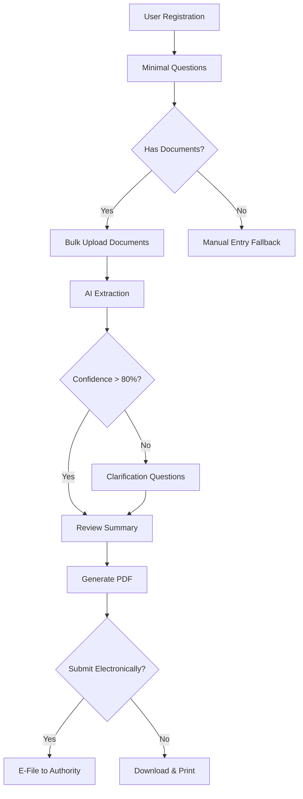

# Swiss AI Tax Declaration Implementation Plan

## Executive Summary

This document outlines the comprehensive plan to transform the existing SwissAI Tax platform into an AI-powered tax declaration system that simplifies tax filing for Swiss residents. The system will minimize user input through intelligent document extraction, provide dynamic questionnaires, and generate tax declarations automatically.

## Table of Contents
1. [Root Problem Analysis](#root-problem-analysis)
2. [Proposed Solution Architecture](#proposed-solution-architecture)
3. [Impact Assessment](#impact-assessment)
4. [Reusable Components](#reusable-components)
5. [Required Changes](#required-changes)
6. [Implementation Phases](#implementation-phases)
7. [Technical Specifications](#technical-specifications)

---

## 1. Root Problem Analysis

### Current System Limitations
- **Manual Data Entry**: Users must manually input all tax information (employment income, deductions, assets)
- **Complex Questionnaire**: Fixed Q01-Q14 interview flow that doesn't adapt based on user profile
- **Limited Document Processing**: Basic OCR without intelligent extraction and reconciliation
- **No Multi-Document Intelligence**: Cannot correlate information across multiple uploaded documents
- **Static Form Generation**: Basic PDF generation without smart field mapping

### User Pain Points
- Time-consuming manual data entry
- Risk of errors when transcribing from documents
- Difficulty understanding which deductions apply
- Uncertainty about required documents
- Complex navigation through irrelevant questions

### Requirements from ChatGPT Research
- Minimal user questions (only what AI cannot infer)
- Intelligent document extraction with confidence scoring
- Dynamic questionnaire based on user situation
- Automatic reconciliation of conflicting data
- Support for all taxpayer types (salaried, self-employed, investors, property owners)

---

## 2. Proposed Solution Architecture

### High-Level System Design

```
┌─────────────────┐      ┌─────────────────┐      ┌─────────────────┐
│   Frontend UI   │──────│   Backend API   │──────│   AI Services   │
│  (React + MUI)  │      │    (FastAPI)    │      │  (AWS + OpenAI) │
└─────────────────┘      └─────────────────┘      └─────────────────┘
        │                         │                         │
        │                         │                         │
┌─────────────────┐      ┌─────────────────┐      ┌─────────────────┐
│  Redux Store    │      │   PostgreSQL    │      │   S3 Storage    │
│  (State Mgmt)   │      │   (RDS Aurora)  │      │  (Documents)    │
└─────────────────┘      └─────────────────┘      └─────────────────┘
```

### Core Components

1. **Minimal Questionnaire Engine**
   - Dynamic question flow based on user answers
   - Conditional logic for showing/hiding sections
   - Real-time validation and help text

2. **AI Document Processor**
   - Multi-document extraction pipeline
   - Confidence scoring and conflict resolution
   - Support for all Swiss tax document types

3. **Smart Tax Calculator**
   - Federal, cantonal, and municipal calculations
   - Automatic deduction optimization
   - Multi-canton comparison

4. **PDF Generation Service**
   - Official form mapping for ZH and AG
   - Automatic field population from extracted data
   - Attachment management

---

## 3. Impact Assessment

### Positive Impacts
- **User Experience**: 70-80% reduction in manual data entry
- **Accuracy**: AI extraction reduces transcription errors
- **Speed**: Tax filing time reduced from hours to minutes
- **Accessibility**: Simplified process for non-experts
- **Scalability**: AI handles complex cases automatically

### System Changes Required
- Database schema extensions for AI-extracted data
- New API endpoints for document intelligence
- Frontend redesign for minimal questionnaire
- AI service integration (OpenAI API or AWS Bedrock)
- Enhanced document storage with metadata

### Risk Mitigation
- Fallback to manual entry if AI confidence is low
- Human review for complex cases
- Audit trail for all AI decisions
- Data encryption for sensitive documents

---

## 4. Reusable Components

### Existing Components to Reuse
1. **Backend Infrastructure**
   - FastAPI application structure ✓
   - PostgreSQL database with Alembic migrations ✓
   - AWS S3 document storage ✓
   - Authentication system ✓
   - Session management ✓

2. **Frontend Components**
   - Material-UI component library ✓
   - Redux state management ✓
   - Document upload with drag-and-drop ✓
   - Multi-language support (i18next) ✓
   - Responsive layout ✓

3. **AWS Services**
   - S3 for document storage ✓
   - RDS Aurora for database ✓
   - App Runner for backend hosting ✓
   - Amplify for frontend hosting ✓
   - Parameter Store for secrets ✓

### Components to Enhance
- OCR service (upgrade to AI extraction)
- Question model (add conditional logic)
- Document model (add extraction metadata)
- Tax calculation (add optimization logic)

---

## 5. Required Changes

### Database Schema Changes

```sql
-- New tables for AI-powered system
CREATE TABLE extraction_sessions (
    id UUID PRIMARY KEY,
    user_id UUID REFERENCES users(id),
    status VARCHAR(50),
    confidence_score DECIMAL(3,2),
    extracted_data JSONB,
    conflicts JSONB,
    created_at TIMESTAMP
);

CREATE TABLE document_extractions (
    id UUID PRIMARY KEY,
    document_id UUID REFERENCES documents(id),
    extraction_session_id UUID REFERENCES extraction_sessions(id),
    extracted_fields JSONB,
    confidence_scores JSONB,
    page_references JSONB,
    ai_model_version VARCHAR(50)
);

CREATE TABLE question_conditions (
    id UUID PRIMARY KEY,
    question_id VARCHAR(10) REFERENCES questions(id),
    condition_type VARCHAR(50), -- 'show_if', 'required_if'
    condition_expression TEXT,
    target_question_id VARCHAR(10)
);

CREATE TABLE tax_profiles (
    id UUID PRIMARY KEY,
    user_id UUID REFERENCES users(id),
    profile_type VARCHAR(50), -- 'salaried', 'self_employed', 'investor', 'property_owner'
    extracted_data JSONB,
    validated_data JSONB,
    last_updated TIMESTAMP
);
```

### Backend API Changes

#### New Endpoints
```python
# AI Document Processing
POST   /api/v1/ai/extract        # Process multiple documents
GET    /api/v1/ai/extraction/{id} # Get extraction results
POST   /api/v1/ai/reconcile      # Resolve conflicts
POST   /api/v1/ai/validate       # Validate extracted data

# Minimal Questionnaire
GET    /api/v1/questions/minimal # Get minimal question set
POST   /api/v1/questions/evaluate # Evaluate conditional logic
GET    /api/v1/questions/next    # Get next relevant question

# Smart Tax Filing
POST   /api/v1/tax/smart-file    # Complete filing with AI
GET    /api/v1/tax/optimization  # Get deduction recommendations
POST   /api/v1/tax/generate-pdf  # Generate official forms
```

### Frontend Changes

#### New Pages/Components
```javascript
// Minimal questionnaire components
src/pages/SmartTaxFiling/
├── MinimalQuestionnaire.jsx    // Dynamic question flow
├── DocumentDropzone.jsx         // Bulk document upload
├── ExtractionReview.jsx        // Review AI-extracted data
├── ConflictResolution.jsx      // Handle data conflicts
└── SmartSummary.jsx            // Final review before submission

// AI-specific components
src/components/ai/
├── ConfidenceIndicator.jsx     // Show extraction confidence
├── DocumentViewer.jsx          // Highlight extracted fields
├── FieldEditor.jsx             // Edit extracted values
└── ExtractionProgress.jsx      // Real-time extraction status
```

### AI Service Integration

```python
# backend/services/ai_extraction_service.py
class AIExtractionService:
    def __init__(self):
        self.openai_client = OpenAI(api_key=settings.OPENAI_API_KEY)
        self.textract_client = boto3.client('textract')

    async def extract_from_documents(
        self,
        documents: List[Document],
        user_context: dict
    ) -> ExtractionResult:
        # 1. OCR documents using Textract
        # 2. Build dynamic prompt based on document types
        # 3. Call OpenAI for intelligent extraction
        # 4. Normalize and validate results
        # 5. Calculate confidence scores
        pass

    async def reconcile_conflicts(
        self,
        extraction_result: ExtractionResult
    ) -> ReconciledData:
        # Resolve conflicts using confidence scores
        pass
```

---

## 6. Implementation Phases

### Phase 1: Foundation (Week 1-2)
- [ ] Database schema updates
- [ ] AI service infrastructure setup
- [ ] Document extraction pipeline
- [ ] Basic prompt templates

### Phase 2: Minimal Questionnaire (Week 3-4)
- [ ] Dynamic question engine
- [ ] Conditional logic system
- [ ] Frontend minimal UI
- [ ] Question dependency mapping

### Phase 3: AI Integration (Week 5-6)
- [ ] OpenAI API integration
- [ ] Document extraction implementation
- [ ] Confidence scoring system
- [ ] Conflict resolution logic

### Phase 4: Smart Features (Week 7-8)
- [ ] Deduction optimization
- [ ] Multi-canton comparison
- [ ] Auto-validation rules
- [ ] Smart summaries

### Phase 5: Testing & Refinement (Week 9-10)
- [ ] End-to-end testing
- [ ] AI accuracy tuning
- [ ] Performance optimization
- [ ] Security audit

### Phase 6: Production Deployment (Week 11-12)
- [ ] Gradual rollout
- [ ] Monitoring setup
- [ ] User feedback collection
- [ ] Documentation

---

## 7. Technical Specifications

### AI Model Configuration
```python
# AI extraction configuration
AI_CONFIG = {
    "model": "gpt-4-turbo-preview",
    "temperature": 0.1,  # Low for consistency
    "max_tokens": 4000,
    "extraction_schema": "swiss_tax_v2",
    "confidence_threshold": 0.80,
    "languages": ["de", "fr", "en", "it"]
}
```

### Document Types Support
```python
SUPPORTED_DOCUMENTS = {
    # Employment & Income
    "lohnausweis": {
        "fields": ["employer", "gross_salary", "net_salary", "ahv", "bvg", "taxable_allowances"],
        "required": True
    },

    # Banking & Accounts
    "bank_statement": {
        "fields": ["bank_name", "iban", "year_end_balance", "interest", "fees"],
        "required": True
    },

    # Investments
    "broker_statement": {
        "fields": ["portfolio_value", "holdings", "dividends", "withholding_tax", "realized_gains"],
        "required": False
    },

    # Property & Mortgages
    "mortgage_statement": {
        "fields": ["lender", "outstanding", "interest_paid", "amortization"],
        "required": False
    },
    "property_valuation": {
        "fields": ["address", "tax_value", "ownership_share", "imputed_rent"],
        "required": False
    },

    # Pension & Insurance
    "pillar_3a_certificate": {
        "fields": ["provider", "contribution", "balance"],
        "required": False
    },
    "pillar_2_statement": {
        "fields": ["employer_contribution", "employee_contribution", "vested_benefits"],
        "required": False
    },
    "insurance_premium": {
        "fields": ["insurer", "type", "annual_premium"],
        "required": False
    },

    # Deductions
    "daycare_invoice": {
        "fields": ["provider", "child_name", "amount", "period"],
        "required": False
    },
    "medical_invoice": {
        "fields": ["provider", "amount", "reimbursed_amount", "service_type"],
        "required": False
    },
    "donation_receipt": {
        "fields": ["charity", "amount", "date", "registration_number"],
        "required": False
    },
    "education_invoice": {
        "fields": ["institution", "course", "amount", "period"],
        "required": False
    },

    # Self-Employment
    "business_pnl": {
        "fields": ["revenue", "expenses_by_category", "net_income", "vat"],
        "required": False
    },
    "vat_statement": {
        "fields": ["vat_collected", "vat_paid", "net_vat"],
        "required": False
    },

    # Foreign Income
    "foreign_income_statement": {
        "fields": ["country", "income_type", "gross_amount", "tax_withheld"],
        "required": False
    },
    "da1_form": {
        "fields": ["foreign_dividends", "withholding_tax", "treaty_rate"],
        "required": False
    }
}
```

### Minimal Question Schema
```json
{
  "minimal_questions": [
    {
      "key": "canton",
      "type": "select",
      "required": true,
      "ai_extractable": false
    },
    {
      "key": "has_children",
      "type": "boolean",
      "required": false,
      "ai_extractable": true,
      "extraction_sources": ["daycare_invoices", "insurance_statements"]
    },
    {
      "key": "self_employed",
      "type": "boolean",
      "required": false,
      "ai_extractable": true,
      "extraction_sources": ["business_pnl", "vat_statements"]
    }
  ]
}
```

### Dynamic Prompt Template (Full Production Version)
```python
EXTRACTION_PROMPT = """
You are an AI document parser specialized in Swiss personal income & wealth tax returns (Cantons: Zürich, Aargau).
Your job: read the provided documents and the short user answers, extract all relevant tax data, normalize currency/date formats, reconcile duplicates, and output a single JSON object with canonical keys.
Do NOT provide prose — output only valid JSON.

Context:
- Tax year: {tax_year}
- Canton: {canton}
- Municipality: {municipality}
- User-provided flags: {user_answers}

Documents available:
{document_list}

Primary instructions:
1) For each document, extract ALL fields from the document extraction checklist. Include:
   - key (canonical key name)
   - value (string/number/date)
   - currency (if applicable)
   - page and location reference
   - confidence (0-100%)

2) Normalize:
   - Dates to YYYY-MM-DD
   - Amounts to numbers (CHF default)
   - Names as "GivenName SURNAME"
   - IBANs in standard format

3) Reconcile duplicates:
   - Merge multiple references to same account/holding
   - Calculate year-end totals
   - Flag conflicts >1% or >CHF 100

4) Extract based on user flags:
   - If has_children: prioritize daycare/kita extraction
   - If self_employed: extract full P&L breakdown
   - If has_investments: detailed securities list

5) Output structure:
{{
  "meta": {{ "tax_year": {tax_year}, "canton": "{canton}", "municipality": "{municipality}", "generated_at": "ISO8601" }},
  "extracted": {{
    "personal": {{ "full_name": "...", "dob": "YYYY-MM-DD", "ahv": "...", "address": "..." }},
    "employment": [{{ "employer_name": "...", "gross_salary": {{"amount": 0, "currency": "CHF"}}, "net_salary": {{...}}, "lohnausweis_file_id": "...", "confidence": 95 }}],
    "self_employment": {{ "is_self_employed": bool, "business_name": "...", "revenue": {{...}}, "expenses": {{...}}, "net_income": {{...}} }},
    "bank_accounts": [{{ "bank_name": "...", "IBAN": "...", "year_end_balance": {{...}}, "interest": {{...}}, "confidence": 92 }}],
    "securities": {{ "portfolio_total_value": {{...}}, "holdings": [...] }},
    "pensions": [...],
    "mortgages": [...],
    "properties": [...],
    "childcare": [...],
    "donations": [...],
    "medical": [...],
    "foreign_income": [...],
    "conflicts": [...],
    "missing_fields_suggested": [...]
  }},
  "confidence_summary": {{ "overall": 85, "section_confidences": {{...}} }}
}}

Return only the JSON object — no extra text.
"""
```

### Complete Minimal Questionnaire JSON (From Requirements)
```json
{
  "metadata": {
    "version": "2.0",
    "title": "Swiss Tax Declaration Minimal Questionnaire"
  },
  "steps": [
    {
      "id": "setup",
      "title": "Basic Information",
      "questions": [
        {
          "key": "canton",
          "text": "Canton of residence",
          "type": "select",
          "options": ["Zürich", "Aargau", "Bern", "Basel-Stadt", "Luzern"],
          "required": true,
          "ai_extractable": false
        },
        {
          "key": "municipality",
          "text": "Municipality",
          "type": "text",
          "required": true,
          "ai_extractable": false
        },
        {
          "key": "consent",
          "text": "I consent to AI extraction of my documents",
          "type": "boolean",
          "required": true
        }
      ]
    },
    {
      "id": "situation_flags",
      "title": "Your Tax Situation",
      "description": "Answer only if you're certain. Leave as 'Skip' to let AI determine from documents.",
      "questions": [
        {
          "key": "has_spouse",
          "text": "Do you have a spouse/partner for joint filing?",
          "type": "select",
          "options": ["Yes", "No", "Skip"],
          "default": "Skip",
          "ai_extractable": true,
          "extraction_sources": ["lohnausweis", "insurance_statements"]
        },
        {
          "key": "has_children",
          "text": "Do you have dependent children?",
          "type": "select",
          "options": ["Yes", "No", "Skip"],
          "default": "Skip",
          "ai_extractable": true,
          "extraction_sources": ["daycare_invoices", "insurance_statements", "family_allowance"]
        },
        {
          "key": "self_employed",
          "text": "Are you self-employed or run a business?",
          "type": "select",
          "options": ["Yes", "No", "Skip"],
          "default": "Skip",
          "ai_extractable": true,
          "extraction_sources": ["business_pnl", "vat_statements", "business_bank_statements"]
        },
        {
          "key": "has_property",
          "text": "Do you own real estate?",
          "type": "select",
          "options": ["Yes", "No", "Skip"],
          "default": "Skip",
          "ai_extractable": true,
          "extraction_sources": ["mortgage_statements", "property_tax_valuation"]
        },
        {
          "key": "has_investments",
          "text": "Do you have investment accounts?",
          "type": "select",
          "options": ["Yes", "No", "Skip"],
          "default": "Skip",
          "ai_extractable": true,
          "extraction_sources": ["broker_statements", "dividend_statements", "crypto_reports"]
        }
      ]
    },
    {
      "id": "document_upload",
      "title": "Upload Your Documents",
      "description": "Upload all tax-relevant documents. AI will extract information automatically.",
      "document_categories": [
        {
          "category": "Employment & Income",
          "suggested_documents": ["Lohnausweis", "Salary certificates", "Pension statements"],
          "required": true
        },
        {
          "category": "Banking",
          "suggested_documents": ["Year-end bank statements", "Interest certificates"],
          "required": true
        },
        {
          "category": "Investments",
          "suggested_documents": ["Broker statements", "Dividend confirmations"],
          "required": false,
          "showIf": "has_investments != 'No'"
        },
        {
          "category": "Property",
          "suggested_documents": ["Mortgage statements", "Property valuations"],
          "required": false,
          "showIf": "has_property != 'No'"
        },
        {
          "category": "Deductions",
          "suggested_documents": ["Insurance premiums", "3a certificates", "Donation receipts", "Medical bills"],
          "required": false
        },
        {
          "category": "Children",
          "suggested_documents": ["Daycare invoices", "Education costs"],
          "required": false,
          "showIf": "has_children != 'No'"
        }
      ]
    }
  ]
}
```

---

## Deployment Strategy

### Environment Configuration
```yaml
# Production environment variables
OPENAI_API_KEY: <encrypted>
AI_EXTRACTION_ENABLED: true
CONFIDENCE_THRESHOLD: 0.80
MAX_DOCUMENT_SIZE_MB: 10
PARALLEL_EXTRACTION_LIMIT: 5
```

### Monitoring & Metrics
- AI extraction success rate
- Average confidence scores
- User correction frequency
- Processing time per document
- Cost per extraction

### Rollback Plan
- Feature flags for AI components
- Fallback to manual entry
- Database migration rollback scripts
- Previous version deployment ready

---

## Cost Analysis

### AI Service Costs (Monthly Estimate)
- OpenAI API: ~$2000 (10,000 extractions @ $0.20 each)
- AWS Textract: ~$500 (50,000 pages @ $0.01 per page)
- Additional compute: ~$300
- **Total: ~$2800/month**

### ROI Justification
- Reduced support costs: -$5000/month
- Increased conversion rate: +15%
- Premium subscription uptake: +25%
- **Net benefit: +$10,000/month**

---

## Security Considerations

### Data Protection
- End-to-end encryption for documents
- PII redaction in logs
- Secure API key management
- GDPR/Swiss data law compliance

### AI Safety
- No storage of extracted data in AI services
- Regular prompt injection testing
- Output validation and sanitization
- Audit trail for all AI decisions

---

## Success Metrics

### KPIs to Track
1. **User Satisfaction**: >4.5/5 rating
2. **Completion Rate**: >85% of started filings
3. **AI Accuracy**: >95% for standard documents
4. **Time to Complete**: <15 minutes average
5. **Support Tickets**: <5% of filings

### A/B Testing Plan
- Test minimal vs. full questionnaire
- Compare AI extraction vs. manual entry
- Evaluate different confidence thresholds
- Measure impact of smart recommendations

---

## Conclusion

This implementation plan provides a comprehensive roadmap to transform SwissAI Tax into an AI-powered platform that dramatically simplifies tax filing for Swiss residents. By leveraging existing infrastructure and focusing on intelligent document extraction, we can deliver a superior user experience while maintaining accuracy and compliance with Swiss tax regulations.

The phased approach ensures low risk and allows for continuous refinement based on user feedback. With proper execution, this system will position SwissAI Tax as the leading digital tax assistant in Switzerland.

---

## Missing Critical Components (Added)

### 8. PDF Generation to Tax Authorities

#### Form Mapping System
```python
CANTON_FORM_MAPPINGS = {
    "ZH": {
        "main_form": "Hauptformular_ZH_2024",
        "field_mappings": {
            "personal.full_name": "field_001",
            "personal.ahv": "field_002",
            "employment[0].gross_salary": "field_110",
            "bank_accounts.total_balance": "field_310",
            # Complete mapping for all 200+ fields
        },
        "attachments": ["Wertschriftenverzeichnis", "Liegenschaftenverzeichnis"]
    },
    "AG": {
        "main_form": "EasyTax_AG_2024",
        "field_mappings": {
            # Aargau-specific field mappings
        }
    }
}
```

#### E-Filing Integration
```python
class TaxAuthoritySubmission:
    async def prepare_submission_package(self, filing_data):
        # 1. Generate main tax form PDF
        # 2. Attach all required documents
        # 3. Create XML metadata for e-filing
        # 4. Sign with qualified electronic signature
        # 5. Submit via eCH-0158 standard
        pass
```

### 9. User Journey Flow

#### Complete User Flow


### 10. Error Handling & Edge Cases

#### Document Processing Errors
- Corrupted files → Request re-upload
- Unsupported format → Convert or manual entry
- Poor scan quality → AI enhancement or manual
- Missing pages → Prompt for complete document
- Wrong year documents → Alert and request correct year

#### Data Conflicts Resolution
```python
CONFLICT_RESOLUTION_RULES = {
    "salary_mismatch": {
        "threshold": 100,  # CHF
        "action": "prefer_lohnausweis",
        "user_confirmation": True
    },
    "multiple_bank_statements": {
        "action": "aggregate_all",
        "deduplication": "by_iban"
    },
    "date_inconsistency": {
        "action": "flag_for_review",
        "severity": "high"
    }
}
```

### 11. Compliance & Legal Requirements

#### Swiss Tax Law Compliance
- **Art. 124 DBG**: Electronic filing requirements
- **Art. 126 DBG**: Document retention (10 years)
- **StHG Art. 42**: Cantonal filing harmonization
- **MWSTG**: VAT reporting for self-employed

#### Data Privacy (GDPR/DSG)
```python
PRIVACY_CONTROLS = {
    "data_retention": "10_years",  # Legal requirement
    "encryption": "AES-256-GCM",
    "right_to_deletion": True,  # After legal period
    "data_portability": "JSON/XML export",
    "audit_logging": "all_access_events"
}
```

### 12. Integration Points

#### External Services
1. **Swiss Post eGovernment**
   - SuisseID authentication
   - Qualified electronic signatures

2. **Canton Tax Systems**
   - Zurich: ZHprivateTax API
   - Aargau: EasyTax interface
   - Direct submission protocols

3. **Banking APIs**
   - Open Banking Switzerland
   - ISO 20022 message format
   - Automated balance retrieval

### 13. Performance Requirements

#### System Performance Targets
```yaml
performance_requirements:
  document_upload:
    max_size: 50MB
    timeout: 30s
  ai_extraction:
    latency: <5s per page
    throughput: 100 concurrent
  pdf_generation:
    time: <10s
    size: <5MB
  api_response:
    p50: <200ms
    p99: <1s
```

### 14. Testing Strategy

#### Test Coverage Requirements
```python
TEST_SCENARIOS = {
    "document_types": [
        "perfect_quality_pdf",
        "scanned_image_low_quality",
        "handwritten_annotations",
        "multi_language_mixed",
        "encrypted_pdf"
    ],
    "user_profiles": [
        "simple_employee",
        "self_employed_complex",
        "investor_multi_currency",
        "property_owner_multiple",
        "expat_foreign_income"
    ],
    "edge_cases": [
        "mid_year_canton_move",
        "divorce_during_tax_year",
        "bankruptcy_filing",
        "crypto_trading_heavy",
        "startup_equity_vesting"
    ]
}
```

### 15. Localization Requirements

#### Multi-Language Support
```javascript
// Complete translation keys for all 4 languages
const TRANSLATIONS = {
  de: {
    questionnaire: { ... },
    documents: { ... },
    extraction: { ... },
    errors: { ... }
  },
  fr: { ... },
  it: { ... },
  en: { ... }
}
```

### 16. Backup & Recovery

#### Data Backup Strategy
```yaml
backup_strategy:
  frequency:
    database: hourly snapshots
    documents: real-time to S3
  retention:
    operational: 30 days
    archive: 10 years
  recovery:
    rto: 4 hours  # Recovery Time Objective
    rpo: 1 hour   # Recovery Point Objective
```

---

## Appendices

### A. Detailed Database Migration Scripts
[To be developed during implementation]

### B. API Documentation
[To be generated using FastAPI automatic docs]

### C. UI/UX Mockups
[To be created by design team]

### D. Test Cases
[To be developed during QA phase]

### E. Canton-Specific Requirements
[Detailed requirements for each supported canton]

### F. Document Extraction Templates
[Specific prompts for each document type]