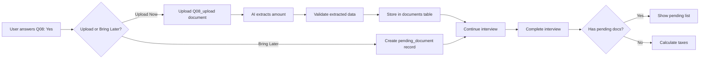

# Frontend Implementation Plan: Document Upload Interview Redesign

**Version:** 1.0
**Date:** 2025-10-14
**Status:** Ready for Implementation

---

## Table of Contents
1. [Overview](#overview)
2. [Architecture Changes](#architecture-changes)
3. [API Changes](#api-changes)
4. [Component Changes](#component-changes)
5. [Step-by-Step Implementation](#step-by-step-implementation)
6. [UI/UX Requirements](#uiux-requirements)
7. [Testing Checklist](#testing-checklist)
8. [Migration Strategy](#migration-strategy)

---

## Overview

### What Changed?
The interview system has been redesigned to use **document uploads instead of manual data entry** for financial information. Users now upload documents (salary statements, tax certificates, etc.) and AI extracts the data automatically.

### Key Benefits
- ✅ **50% faster** - Users upload documents instead of typing numbers
- ✅ **More accurate** - AI extracts data directly from official documents
- ✅ **Better UX** - "Bring later" option for missing documents
- ✅ **Compliance** - Original documents stored for audit trail

### What Changed in Questions?
| Question | Old Design | New Design |
|----------|-----------|------------|
| Q01a | Spouse first name (TEXT) | Spouse AHV number (AHV_NUMBER) |
| Q01b | Spouse last name (TEXT) | **REMOVED** |
| Q08a | Pillar 3a amount (CURRENCY) | **DOCUMENT_UPLOAD** |
| Q11a | Donation amount (CURRENCY) | **DOCUMENT_UPLOAD** |
| Q12a | Alimony amount (CURRENCY) | **DOCUMENT_UPLOAD** |
| Q13a | Medical expense amount (CURRENCY) | **DOCUMENT_UPLOAD** |

---

## Architecture Changes

### Before (Manual Entry)
```
User → Types amount → Validate → Store → Calculate taxes
```

### After (Document Upload)
```
User → Uploads document → AI extracts → Validate → Store → Calculate taxes
         ↓ (optional)
     "Bring later" → Track pending → Remind user
```

### New Data Flow


---

## API Changes

### 1. Interview Session Response (Enhanced)

**Endpoint:** `POST /api/interview/sessions/{session_id}/answer`

**New Response Fields:**
```typescript
interface InterviewResponse {
  // Existing fields...
  session_id: string;
  current_question: Question;
  progress: number;
  complete: boolean;

  // NEW: Document upload handling
  pending_upload?: {
    question_id: string;        // e.g., "Q08_upload"
    document_type: string;      // e.g., "pillar_3a_certificate"
    required: boolean;
    allow_later: boolean;
    help_text: string;
  };

  // NEW: Pending documents summary
  pending_documents?: {
    count: number;
    documents: PendingDocument[];
  };
}
```

### 2. New Question Type: `DOCUMENT_UPLOAD`

```typescript
interface DocumentUploadQuestion extends Question {
  type: "DOCUMENT_UPLOAD";
  document_type: string;       // e.g., "pillar_3a_certificate"
  accepted_formats: string[];  // ["pdf", "jpg", "png"]
  max_size_mb: number;         // 10
  allow_bring_later: boolean;  // true
  help_text: string;
  sample_url?: string;         // Link to sample document
}
```

### 3. New Pending Documents Endpoints

#### Get Pending Documents
```http
GET /api/interview/sessions/{session_id}/pending-documents
```

**Response:**
```json
{
  "pending_documents": [
    {
      "id": "uuid",
      "question_id": "Q08_upload",
      "document_type": "pillar_3a_certificate",
      "status": "pending",
      "document_label": "Pillar 3a Certificate",
      "help_text": "Upload your 3a savings certificate",
      "created_at": "2025-10-14T10:00:00Z"
    }
  ],
  "count": 1
}
```

#### Upload Pending Document
```http
POST /api/interview/sessions/{session_id}/pending-documents/{document_id}/upload
Content-Type: multipart/form-data
```

**Request:**
```
file: <binary>
```

**Response:**
```json
{
  "success": true,
  "document_id": "uploaded-doc-uuid",
  "extracted_data": {
    "amount": 7056.00,
    "year": 2024,
    "confidence": 0.95
  },
  "status": "verified",
  "message": "Document processed successfully"
}
```

#### Mark Document as Not Needed
```http
DELETE /api/interview/sessions/{session_id}/pending-documents/{document_id}
```

### 4. Enhanced Calculate Endpoint

**Endpoint:** `POST /api/calculate`

**New Validation:**
```json
{
  "error": "pending_documents_exist",
  "message": "Please upload all required documents or mark them as not needed",
  "pending_documents": [
    {
      "id": "uuid",
      "document_type": "pillar_3a_certificate",
      "document_label": "Pillar 3a Certificate"
    }
  ],
  "can_proceed": false
}
```

---

## Component Changes

### 1. New Components Needed

#### `DocumentUploadQuestion.tsx`
```typescript
interface DocumentUploadQuestionProps {
  question: DocumentUploadQuestion;
  sessionId: string;
  onUploadComplete: (data: ExtractedData) => void;
  onBringLater: () => void;
}

// Features:
// - Drag-and-drop upload zone
// - File validation (type, size)
// - Upload progress indicator
// - "Bring later" button
// - Sample document preview
// - Help text with examples
```

#### `PendingDocumentsList.tsx`
```typescript
interface PendingDocumentsListProps {
  sessionId: string;
  pendingDocuments: PendingDocument[];
  onDocumentUploaded: (docId: string) => void;
  onDocumentRemoved: (docId: string) => void;
}

// Features:
// - List of pending documents
// - Upload button for each
// - "Mark as not needed" button
// - Status badges (pending/uploaded/verified)
// - Document type icons
// - Help tooltips
```

#### `PendingDocumentsModal.tsx`
```typescript
// Modal shown when user tries to calculate with pending docs
interface PendingDocumentsModalProps {
  pendingDocuments: PendingDocument[];
  onUpload: (docId: string, file: File) => void;
  onSkip: (docId: string) => void;
  onClose: () => void;
}
```

#### `DocumentExtractionPreview.tsx`
```typescript
// Show extracted data for user confirmation
interface DocumentExtractionPreviewProps {
  extractedData: ExtractedData;
  confidence: number;
  onConfirm: () => void;
  onEdit: (data: Partial<ExtractedData>) => void;
  onReject: () => void;
}
```

### 2. Modified Components

#### `InterviewQuestion.tsx`
```typescript
// Add new case for DOCUMENT_UPLOAD type
function InterviewQuestion({ question, sessionId, onAnswer }) {
  switch (question.type) {
    case 'TEXT':
      return <TextQuestion {...props} />;
    case 'AHV_NUMBER':  // NEW
      return <AHVNumberInput {...props} />;
    case 'DOCUMENT_UPLOAD':  // NEW
      return <DocumentUploadQuestion {...props} />;
    // ... other types
  }
}
```

#### `InterviewProgress.tsx`
```typescript
// Add pending documents indicator
function InterviewProgress({ progress, pendingDocumentsCount }) {
  return (
    <div>
      <ProgressBar value={progress} />
      {pendingDocumentsCount > 0 && (
        <PendingDocumentsBadge count={pendingDocumentsCount} />
      )}
    </div>
  );
}
```

#### `ReviewPage.tsx`
```typescript
// Add pending documents section
function ReviewPage({ sessionId, profile, pendingDocuments }) {
  return (
    <div>
      <ProfileSummary data={profile} />

      {pendingDocuments.length > 0 && (
        <PendingDocumentsSection
          documents={pendingDocuments}
          onUpload={handleUpload}
        />
      )}

      <Button onClick={handleCalculate}>
        Calculate Taxes
      </Button>
    </div>
  );
}
```

---

## Step-by-Step Implementation

### Phase 1: Core Infrastructure (Week 1)

#### Step 1.1: Add New Question Types
**File:** `src/types/interview.ts`

```typescript
export enum QuestionType {
  TEXT = 'TEXT',
  NUMBER = 'NUMBER',
  CURRENCY = 'CURRENCY',
  YES_NO = 'YES_NO',
  SINGLE_CHOICE = 'SINGLE_CHOICE',
  DROPDOWN = 'DROPDOWN',
  AHV_NUMBER = 'AHV_NUMBER',        // NEW
  DOCUMENT_UPLOAD = 'DOCUMENT_UPLOAD', // NEW
  POSTAL_CODE = 'POSTAL_CODE',
  GROUP = 'GROUP',
  DATE = 'DATE'
}

export interface DocumentUploadQuestion extends BaseQuestion {
  type: QuestionType.DOCUMENT_UPLOAD;
  document_type: string;
  accepted_formats: string[];
  max_size_mb: number;
  allow_bring_later: boolean;
  help_text: string;
  sample_url?: string;
}

export interface PendingDocument {
  id: string;
  question_id: string;
  document_type: string;
  status: 'pending' | 'uploaded' | 'verified' | 'failed';
  document_label: string;
  help_text: string;
  document_id?: string;
  created_at: string;
  uploaded_at?: string;
}
```

#### Step 1.2: Create AHV Number Input Component
**File:** `src/components/interview/AHVNumberInput.tsx`

```typescript
import React, { useState } from 'react';
import { TextField, FormHelperText } from '@mui/material';

interface AHVNumberInputProps {
  value: string;
  onChange: (value: string) => void;
  error?: string;
  label: string;
  required?: boolean;
}

export function AHVNumberInput({
  value,
  onChange,
  error,
  label,
  required
}: AHVNumberInputProps) {
  const [rawValue, setRawValue] = useState(value);

  const formatAHV = (input: string) => {
    // Remove all non-digits
    const digits = input.replace(/\D/g, '');

    // Format as 756.XXXX.XXXX.XX
    if (digits.length <= 3) return digits;
    if (digits.length <= 7) return `${digits.slice(0, 3)}.${digits.slice(3)}`;
    if (digits.length <= 11) return `${digits.slice(0, 3)}.${digits.slice(3, 7)}.${digits.slice(7)}`;
    return `${digits.slice(0, 3)}.${digits.slice(3, 7)}.${digits.slice(7, 11)}.${digits.slice(11, 13)}`;
  };

  const handleChange = (e: React.ChangeEvent<HTMLInputElement>) => {
    const formatted = formatAHV(e.target.value);
    setRawValue(formatted);
    onChange(formatted);
  };

  const validateAHV = (ahv: string) => {
    // Basic validation: 756.XXXX.XXXX.XX format
    const pattern = /^756\.\d{4}\.\d{4}\.\d{2}$/;
    return pattern.test(ahv);
  };

  return (
    <div>
      <TextField
        label={label}
        value={rawValue}
        onChange={handleChange}
        required={required}
        error={!!error || (rawValue && !validateAHV(rawValue))}
        placeholder="756.1234.5678.97"
        helperText={error || "Format: 756.XXXX.XXXX.XX"}
        fullWidth
        inputProps={{
          maxLength: 16 // 756.XXXX.XXXX.XX
        }}
      />
      <FormHelperText>
        Your Swiss social security number (AHV/AVS)
      </FormHelperText>
    </div>
  );
}
```

#### Step 1.3: Create Document Upload Component
**File:** `src/components/interview/DocumentUploadQuestion.tsx`

```typescript
import React, { useState, useCallback } from 'react';
import { useDropzone } from 'react-dropzone';
import {
  Box,
  Button,
  Typography,
  LinearProgress,
  Alert,
  Link,
  Paper
} from '@mui/material';
import {
  CloudUpload,
  InsertDriveFile,
  CheckCircle,
  Error as ErrorIcon
} from '@mui/icons-material';
import { uploadDocument } from '@/api/interview';

interface DocumentUploadQuestionProps {
  question: DocumentUploadQuestion;
  sessionId: string;
  onUploadComplete: (data: any) => void;
  onBringLater: () => void;
}

export function DocumentUploadQuestion({
  question,
  sessionId,
  onUploadComplete,
  onBringLater
}: DocumentUploadQuestionProps) {
  const [uploading, setUploading] = useState(false);
  const [progress, setProgress] = useState(0);
  const [error, setError] = useState<string | null>(null);
  const [uploadedFile, setUploadedFile] = useState<File | null>(null);

  const onDrop = useCallback(async (acceptedFiles: File[]) => {
    const file = acceptedFiles[0];
    if (!file) return;

    // Validate file size
    const maxSizeMB = question.max_size_mb || 10;
    if (file.size > maxSizeMB * 1024 * 1024) {
      setError(`File too large. Maximum size is ${maxSizeMB}MB`);
      return;
    }

    // Validate file type
    const extension = file.name.split('.').pop()?.toLowerCase();
    if (!question.accepted_formats.includes(extension || '')) {
      setError(`Invalid file type. Accepted: ${question.accepted_formats.join(', ')}`);
      return;
    }

    setError(null);
    setUploading(true);
    setUploadedFile(file);

    try {
      const formData = new FormData();
      formData.append('file', file);
      formData.append('question_id', question.id);
      formData.append('document_type', question.document_type);

      const response = await uploadDocument(sessionId, question.id, formData, {
        onUploadProgress: (progressEvent) => {
          const percentCompleted = Math.round(
            (progressEvent.loaded * 100) / (progressEvent.total || 1)
          );
          setProgress(percentCompleted);
        }
      });

      onUploadComplete(response.data);
    } catch (err: any) {
      setError(err.response?.data?.error || 'Upload failed. Please try again.');
      setUploadedFile(null);
    } finally {
      setUploading(false);
      setProgress(0);
    }
  }, [question, sessionId, onUploadComplete]);

  const { getRootProps, getInputProps, isDragActive } = useDropzone({
    onDrop,
    accept: question.accepted_formats.reduce((acc, format) => {
      acc[`application/${format}`] = [`.${format}`];
      acc[`image/${format}`] = [`.${format}`];
      return acc;
    }, {} as Record<string, string[]>),
    maxFiles: 1,
    disabled: uploading
  });

  return (
    <Box sx={{ my: 3 }}>
      <Typography variant="h6" gutterBottom>
        {question.text}
      </Typography>

      {question.help_text && (
        <Alert severity="info" sx={{ mb: 2 }}>
          {question.help_text}
        </Alert>
      )}

      {question.sample_url && (
        <Box sx={{ mb: 2 }}>
          <Link href={question.sample_url} target="_blank" rel="noopener">
            View sample document
          </Link>
        </Box>
      )}

      {error && (
        <Alert severity="error" sx={{ mb: 2 }} onClose={() => setError(null)}>
          {error}
        </Alert>
      )}

      <Paper
        {...getRootProps()}
        sx={{
          p: 4,
          border: '2px dashed',
          borderColor: isDragActive ? 'primary.main' : 'grey.300',
          bgcolor: isDragActive ? 'action.hover' : 'background.paper',
          cursor: uploading ? 'not-allowed' : 'pointer',
          textAlign: 'center',
          transition: 'all 0.2s ease',
          '&:hover': {
            borderColor: 'primary.main',
            bgcolor: 'action.hover'
          }
        }}
      >
        <input {...getInputProps()} />

        {uploading ? (
          <Box>
            <Typography variant="body1" gutterBottom>
              Uploading {uploadedFile?.name}...
            </Typography>
            <LinearProgress variant="determinate" value={progress} sx={{ my: 2 }} />
            <Typography variant="body2" color="text.secondary">
              {progress}% complete
            </Typography>
          </Box>
        ) : uploadedFile ? (
          <Box>
            <CheckCircle color="success" sx={{ fontSize: 48, mb: 1 }} />
            <Typography variant="body1">
              {uploadedFile.name} uploaded successfully
            </Typography>
          </Box>
        ) : (
          <Box>
            <CloudUpload sx={{ fontSize: 48, color: 'primary.main', mb: 2 }} />
            <Typography variant="h6" gutterBottom>
              {isDragActive
                ? 'Drop your document here'
                : 'Drag & drop your document here'}
            </Typography>
            <Typography variant="body2" color="text.secondary" gutterBottom>
              or click to browse
            </Typography>
            <Typography variant="caption" color="text.secondary">
              Accepted formats: {question.accepted_formats.join(', ')} (max {question.max_size_mb}MB)
            </Typography>
          </Box>
        )}
      </Paper>

      {question.allow_bring_later && (
        <Box sx={{ mt: 2, textAlign: 'center' }}>
          <Button
            variant="outlined"
            onClick={onBringLater}
            disabled={uploading}
          >
            I'll bring this document later
          </Button>
          <Typography variant="caption" display="block" sx={{ mt: 1 }}>
            You can upload it before calculating your taxes
          </Typography>
        </Box>
      )}
    </Box>
  );
}
```

### Phase 2: Pending Documents Management (Week 2)

#### Step 2.1: Create Pending Documents API Client
**File:** `src/api/pendingDocuments.ts`

```typescript
import axios from 'axios';

const API_BASE_URL = process.env.NEXT_PUBLIC_API_URL || 'http://localhost:8000';

export interface PendingDocument {
  id: string;
  question_id: string;
  document_type: string;
  status: 'pending' | 'uploaded' | 'verified' | 'failed';
  document_label: string;
  help_text: string;
  document_id?: string;
  created_at: string;
  uploaded_at?: string;
}

export const pendingDocumentsApi = {
  // Get all pending documents for a session
  getPendingDocuments: async (sessionId: string) => {
    const response = await axios.get(
      `${API_BASE_URL}/api/interview/sessions/${sessionId}/pending-documents`
    );
    return response.data;
  },

  // Upload a pending document
  uploadPendingDocument: async (
    sessionId: string,
    documentId: string,
    file: File,
    onProgress?: (progress: number) => void
  ) => {
    const formData = new FormData();
    formData.append('file', file);

    const response = await axios.post(
      `${API_BASE_URL}/api/interview/sessions/${sessionId}/pending-documents/${documentId}/upload`,
      formData,
      {
        headers: { 'Content-Type': 'multipart/form-data' },
        onUploadProgress: (progressEvent) => {
          if (onProgress && progressEvent.total) {
            const percentCompleted = Math.round(
              (progressEvent.loaded * 100) / progressEvent.total
            );
            onProgress(percentCompleted);
          }
        }
      }
    );
    return response.data;
  },

  // Mark document as not needed
  deletePendingDocument: async (sessionId: string, documentId: string) => {
    const response = await axios.delete(
      `${API_BASE_URL}/api/interview/sessions/${sessionId}/pending-documents/${documentId}`
    );
    return response.data;
  },

  // Check if session has pending documents
  hasPendingDocuments: async (sessionId: string): Promise<boolean> => {
    const data = await pendingDocumentsApi.getPendingDocuments(sessionId);
    return data.pending_documents.length > 0;
  }
};
```

#### Step 2.2: Create Pending Documents List Component
**File:** `src/components/interview/PendingDocumentsList.tsx`

```typescript
import React, { useState } from 'react';
import {
  Box,
  Card,
  CardContent,
  Typography,
  Button,
  List,
  ListItem,
  ListItemIcon,
  ListItemText,
  ListItemSecondaryAction,
  IconButton,
  Chip,
  Dialog,
  DialogTitle,
  DialogContent,
  DialogActions,
  Alert
} from '@mui/material';
import {
  Description,
  CloudUpload,
  Delete,
  CheckCircle,
  Error as ErrorIcon,
  HourglassEmpty
} from '@mui/icons-material';
import { PendingDocument } from '@/api/pendingDocuments';

interface PendingDocumentsListProps {
  sessionId: string;
  pendingDocuments: PendingDocument[];
  onDocumentUploaded: (docId: string) => void;
  onDocumentRemoved: (docId: string) => void;
}

export function PendingDocumentsList({
  sessionId,
  pendingDocuments,
  onDocumentUploaded,
  onDocumentRemoved
}: PendingDocumentsListProps) {
  const [selectedDoc, setSelectedDoc] = useState<PendingDocument | null>(null);
  const [uploadDialogOpen, setUploadDialogOpen] = useState(false);

  const getStatusIcon = (status: PendingDocument['status']) => {
    switch (status) {
      case 'pending':
        return <HourglassEmpty color="warning" />;
      case 'uploaded':
      case 'verified':
        return <CheckCircle color="success" />;
      case 'failed':
        return <ErrorIcon color="error" />;
    }
  };

  const getStatusChip = (status: PendingDocument['status']) => {
    const config = {
      pending: { label: 'Pending', color: 'warning' as const },
      uploaded: { label: 'Uploaded', color: 'success' as const },
      verified: { label: 'Verified', color: 'success' as const },
      failed: { label: 'Failed', color: 'error' as const }
    };
    return <Chip size="small" {...config[status]} />;
  };

  const handleUploadClick = (doc: PendingDocument) => {
    setSelectedDoc(doc);
    setUploadDialogOpen(true);
  };

  const handleRemoveClick = (doc: PendingDocument) => {
    if (window.confirm(`Remove "${doc.document_label}"? This document won't be required.`)) {
      onDocumentRemoved(doc.id);
    }
  };

  if (pendingDocuments.length === 0) {
    return null;
  }

  return (
    <Card sx={{ my: 3 }}>
      <CardContent>
        <Box sx={{ display: 'flex', alignItems: 'center', mb: 2 }}>
          <Description sx={{ mr: 1 }} />
          <Typography variant="h6">
            Pending Documents ({pendingDocuments.length})
          </Typography>
        </Box>

        <Alert severity="info" sx={{ mb: 2 }}>
          Upload these documents before calculating your taxes, or mark them as not needed.
        </Alert>

        <List>
          {pendingDocuments.map((doc) => (
            <ListItem
              key={doc.id}
              sx={{
                border: '1px solid',
                borderColor: 'divider',
                borderRadius: 1,
                mb: 1
              }}
            >
              <ListItemIcon>
                {getStatusIcon(doc.status)}
              </ListItemIcon>
              <ListItemText
                primary={doc.document_label}
                secondary={doc.help_text}
              />
              <ListItemSecondaryAction>
                <Box sx={{ display: 'flex', alignItems: 'center', gap: 1 }}>
                  {getStatusChip(doc.status)}
                  {doc.status === 'pending' && (
                    <>
                      <Button
                        size="small"
                        variant="contained"
                        startIcon={<CloudUpload />}
                        onClick={() => handleUploadClick(doc)}
                      >
                        Upload
                      </Button>
                      <IconButton
                        size="small"
                        onClick={() => handleRemoveClick(doc)}
                        title="Mark as not needed"
                      >
                        <Delete />
                      </IconButton>
                    </>
                  )}
                </Box>
              </ListItemSecondaryAction>
            </ListItem>
          ))}
        </List>
      </CardContent>

      {/* Upload Dialog */}
      <Dialog
        open={uploadDialogOpen}
        onClose={() => setUploadDialogOpen(false)}
        maxWidth="sm"
        fullWidth
      >
        <DialogTitle>Upload {selectedDoc?.document_label}</DialogTitle>
        <DialogContent>
          {selectedDoc && (
            <DocumentUploadQuestion
              question={{
                id: selectedDoc.question_id,
                type: 'DOCUMENT_UPLOAD',
                text: selectedDoc.document_label,
                help_text: selectedDoc.help_text,
                document_type: selectedDoc.document_type,
                accepted_formats: ['pdf', 'jpg', 'png'],
                max_size_mb: 10,
                allow_bring_later: false
              }}
              sessionId={sessionId}
              onUploadComplete={() => {
                onDocumentUploaded(selectedDoc.id);
                setUploadDialogOpen(false);
              }}
              onBringLater={() => {}}
            />
          )}
        </DialogContent>
        <DialogActions>
          <Button onClick={() => setUploadDialogOpen(false)}>
            Cancel
          </Button>
        </DialogActions>
      </Dialog>
    </Card>
  );
}
```

### Phase 3: Integration with Interview Flow (Week 3)

#### Step 3.1: Update Interview Question Router
**File:** `src/components/interview/InterviewQuestion.tsx`

```typescript
import React from 'react';
import { Question, QuestionType } from '@/types/interview';
import { TextQuestion } from './TextQuestion';
import { NumberQuestion } from './NumberQuestion';
import { YesNoQuestion } from './YesNoQuestion';
import { AHVNumberInput } from './AHVNumberInput';
import { DocumentUploadQuestion } from './DocumentUploadQuestion';
// ... other imports

interface InterviewQuestionProps {
  question: Question;
  sessionId: string;
  onAnswer: (answer: any) => void;
}

export function InterviewQuestion({
  question,
  sessionId,
  onAnswer
}: InterviewQuestionProps) {
  // Handle document upload questions
  if (question.type === QuestionType.DOCUMENT_UPLOAD) {
    return (
      <DocumentUploadQuestion
        question={question}
        sessionId={sessionId}
        onUploadComplete={(data) => {
          // AI extracted data, submit as answer
          onAnswer({
            question_id: question.id,
            answer: 'uploaded',
            extracted_data: data
          });
        }}
        onBringLater={() => {
          // User chose to bring later
          onAnswer({
            question_id: question.id,
            answer: 'bring_later'
          });
        }}
      />
    );
  }

  // Handle AHV number input
  if (question.type === QuestionType.AHV_NUMBER) {
    return (
      <AHVNumberInput
        value=""
        onChange={(value) => {
          // Validate and submit
          if (value.match(/^756\.\d{4}\.\d{4}\.\d{2}$/)) {
            onAnswer({
              question_id: question.id,
              answer: value
            });
          }
        }}
        label={question.text}
        required={question.required}
      />
    );
  }

  // Existing question types...
  switch (question.type) {
    case QuestionType.TEXT:
      return <TextQuestion question={question} onAnswer={onAnswer} />;
    case QuestionType.NUMBER:
      return <NumberQuestion question={question} onAnswer={onAnswer} />;
    case QuestionType.YES_NO:
      return <YesNoQuestion question={question} onAnswer={onAnswer} />;
    // ... other cases
    default:
      return <div>Unsupported question type: {question.type}</div>;
  }
}
```

#### Step 3.2: Update Interview Page with Pending Documents
**File:** `src/pages/interview/[sessionId].tsx`

```typescript
import React, { useState, useEffect } from 'react';
import { useRouter } from 'next/router';
import { Container, Box, Button, LinearProgress } from '@mui/material';
import { InterviewQuestion } from '@/components/interview/InterviewQuestion';
import { PendingDocumentsList } from '@/components/interview/PendingDocumentsList';
import { interviewApi } from '@/api/interview';
import { pendingDocumentsApi } from '@/api/pendingDocuments';

export default function InterviewPage() {
  const router = useRouter();
  const { sessionId } = router.query;
  const [session, setSession] = useState<any>(null);
  const [pendingDocuments, setPendingDocuments] = useState<any[]>([]);
  const [loading, setLoading] = useState(true);

  useEffect(() => {
    if (sessionId) {
      loadSession();
      loadPendingDocuments();
    }
  }, [sessionId]);

  const loadSession = async () => {
    try {
      const data = await interviewApi.getSession(sessionId as string);
      setSession(data);
    } catch (error) {
      console.error('Failed to load session:', error);
    } finally {
      setLoading(false);
    }
  };

  const loadPendingDocuments = async () => {
    try {
      const data = await pendingDocumentsApi.getPendingDocuments(sessionId as string);
      setPendingDocuments(data.pending_documents || []);
    } catch (error) {
      console.error('Failed to load pending documents:', error);
    }
  };

  const handleAnswer = async (answer: any) => {
    try {
      const response = await interviewApi.submitAnswer(
        sessionId as string,
        answer.question_id,
        answer.answer
      );
      setSession(response);

      // Reload pending documents if answer was "bring_later"
      if (answer.answer === 'bring_later') {
        await loadPendingDocuments();
      }

      // If interview complete, show review page
      if (response.complete) {
        router.push(`/interview/${sessionId}/review`);
      }
    } catch (error) {
      console.error('Failed to submit answer:', error);
    }
  };

  const handleDocumentUploaded = async (docId: string) => {
    await loadPendingDocuments();
    // Optionally reload session to update progress
    await loadSession();
  };

  const handleDocumentRemoved = async (docId: string) => {
    try {
      await pendingDocumentsApi.deletePendingDocument(
        sessionId as string,
        docId
      );
      await loadPendingDocuments();
    } catch (error) {
      console.error('Failed to remove document:', error);
    }
  };

  if (loading) {
    return <LinearProgress />;
  }

  return (
    <Container maxWidth="md">
      <Box sx={{ py: 4 }}>
        {/* Progress Bar */}
        <Box sx={{ mb: 4 }}>
          <LinearProgress
            variant="determinate"
            value={session?.progress || 0}
          />
          <Box sx={{ display: 'flex', justifyContent: 'space-between', mt: 1 }}>
            <span>Progress: {session?.progress || 0}%</span>
            {pendingDocuments.length > 0 && (
              <span>📄 {pendingDocuments.length} pending documents</span>
            )}
          </Box>
        </Box>

        {/* Pending Documents List */}
        <PendingDocumentsList
          sessionId={sessionId as string}
          pendingDocuments={pendingDocuments}
          onDocumentUploaded={handleDocumentUploaded}
          onDocumentRemoved={handleDocumentRemoved}
        />

        {/* Current Question */}
        {session?.current_question && (
          <InterviewQuestion
            question={session.current_question}
            sessionId={sessionId as string}
            onAnswer={handleAnswer}
          />
        )}
      </Box>
    </Container>
  );
}
```

#### Step 3.3: Update Review Page with Pending Documents Check
**File:** `src/pages/interview/[sessionId]/review.tsx`

```typescript
import React, { useState, useEffect } from 'react';
import { useRouter } from 'next/router';
import {
  Container,
  Box,
  Button,
  Typography,
  Card,
  CardContent,
  Alert,
  Dialog,
  DialogTitle,
  DialogContent,
  DialogActions
} from '@mui/material';
import { PendingDocumentsList } from '@/components/interview/PendingDocumentsList';
import { interviewApi } from '@/api/interview';
import { pendingDocumentsApi } from '@/api/pendingDocuments';

export default function ReviewPage() {
  const router = useRouter();
  const { sessionId } = router.query;
  const [session, setSession] = useState<any>(null);
  const [pendingDocuments, setPendingDocuments] = useState<any[]>([]);
  const [showPendingModal, setShowPendingModal] = useState(false);
  const [calculating, setCalculating] = useState(false);

  useEffect(() => {
    if (sessionId) {
      loadData();
    }
  }, [sessionId]);

  const loadData = async () => {
    try {
      const [sessionData, pendingData] = await Promise.all([
        interviewApi.getSession(sessionId as string),
        pendingDocumentsApi.getPendingDocuments(sessionId as string)
      ]);
      setSession(sessionData);
      setPendingDocuments(pendingData.pending_documents || []);
    } catch (error) {
      console.error('Failed to load data:', error);
    }
  };

  const handleCalculate = async () => {
    // Check for pending documents
    if (pendingDocuments.length > 0) {
      setShowPendingModal(true);
      return;
    }

    // Proceed with calculation
    try {
      setCalculating(true);
      const response = await interviewApi.calculate(sessionId as string);
      router.push(`/results/${response.filing_id}`);
    } catch (error: any) {
      if (error.response?.data?.error === 'pending_documents_exist') {
        // Backend returned pending documents error
        setShowPendingModal(true);
      } else {
        console.error('Calculation failed:', error);
      }
    } finally {
      setCalculating(false);
    }
  };

  const handleProceedWithoutDocs = async () => {
    // User acknowledges they're proceeding without some documents
    try {
      setCalculating(true);
      setShowPendingModal(false);
      const response = await interviewApi.calculate(
        sessionId as string,
        { ignore_pending_documents: true }
      );
      router.push(`/results/${response.filing_id}`);
    } catch (error) {
      console.error('Calculation failed:', error);
    } finally {
      setCalculating(false);
    }
  };

  return (
    <Container maxWidth="md">
      <Box sx={{ py: 4 }}>
        <Typography variant="h4" gutterBottom>
          Review Your Information
        </Typography>

        {/* Profile Summary */}
        <Card sx={{ mb: 3 }}>
          <CardContent>
            <Typography variant="h6" gutterBottom>
              Personal Information
            </Typography>
            {/* Display profile data */}
            <pre>{JSON.stringify(session?.profile, null, 2)}</pre>
          </CardContent>
        </Card>

        {/* Pending Documents */}
        {pendingDocuments.length > 0 && (
          <Alert severity="warning" sx={{ mb: 3 }}>
            <Typography variant="subtitle1" gutterBottom>
              ⚠️ You have {pendingDocuments.length} pending document(s)
            </Typography>
            <Typography variant="body2">
              Upload these documents for accurate tax calculations, or mark them as not needed.
            </Typography>
          </Alert>
        )}

        <PendingDocumentsList
          sessionId={sessionId as string}
          pendingDocuments={pendingDocuments}
          onDocumentUploaded={loadData}
          onDocumentRemoved={loadData}
        />

        {/* Calculate Button */}
        <Box sx={{ mt: 3, display: 'flex', gap: 2 }}>
          <Button
            variant="outlined"
            onClick={() => router.back()}
          >
            Go Back
          </Button>
          <Button
            variant="contained"
            size="large"
            onClick={handleCalculate}
            disabled={calculating}
            fullWidth
          >
            {calculating ? 'Calculating...' : 'Calculate My Taxes'}
          </Button>
        </Box>
      </Box>

      {/* Pending Documents Modal */}
      <Dialog
        open={showPendingModal}
        onClose={() => setShowPendingModal(false)}
        maxWidth="sm"
        fullWidth
      >
        <DialogTitle>Pending Documents</DialogTitle>
        <DialogContent>
          <Alert severity="warning" sx={{ mb: 2 }}>
            You have {pendingDocuments.length} document(s) that haven't been uploaded yet.
          </Alert>
          <Typography variant="body2" paragraph>
            For the most accurate tax calculation, we recommend uploading all documents.
            However, you can proceed without them if you prefer.
          </Typography>
          <Typography variant="body2">
            Missing documents:
          </Typography>
          <ul>
            {pendingDocuments.map((doc) => (
              <li key={doc.id}>
                <Typography variant="body2">{doc.document_label}</Typography>
              </li>
            ))}
          </ul>
        </DialogContent>
        <DialogActions>
          <Button onClick={() => setShowPendingModal(false)}>
            Upload Documents
          </Button>
          <Button
            variant="contained"
            onClick={handleProceedWithoutDocs}
          >
            Proceed Anyway
          </Button>
        </DialogActions>
      </Dialog>
    </Container>
  );
}
```

---

## UI/UX Requirements

### Design Specifications

#### 1. Document Upload Component
- **Size:** Full-width dropzone, minimum height 200px
- **States:**
  - Default: Dashed border, upload icon, instructions
  - Hover: Solid border, highlighted background
  - Drag Active: Blue border, blue background
  - Uploading: Progress bar with percentage
  - Success: Green checkmark, filename
  - Error: Red alert with error message

#### 2. Pending Documents Badge
- **Location:** Top-right of progress bar
- **Style:** Orange badge with document count
- **Action:** Click to scroll to pending documents section

#### 3. Pending Documents List
- **Layout:** Card with list items
- **Item Structure:**
  - Icon (status-based)
  - Document name (bold)
  - Help text (secondary text)
  - Status chip
  - Action buttons (Upload, Remove)

#### 4. AHV Number Input
- **Format:** Auto-format as user types (756.XXXX.XXXX.XX)
- **Validation:** Real-time with visual feedback
- **Help Text:** "Your Swiss social security number (AHV/AVS)"

### Mobile Responsiveness
- Stack buttons vertically on small screens
- Collapse pending documents list with expand button
- Full-screen upload modal on mobile
- Touch-friendly upload dropzone (larger tap targets)

### Accessibility
- ARIA labels for all interactive elements
- Keyboard navigation support
- Screen reader announcements for upload progress
- Color contrast ratios meet WCAG AA standards
- Focus indicators on all focusable elements

### Loading States
- Skeleton loaders for pending documents list
- Progress bars for uploads
- Disabled state for buttons during operations
- Loading spinner for page transitions

---

## Testing Checklist

### Unit Tests

#### Components
- [ ] `AHVNumberInput` - validates and formats correctly
- [ ] `DocumentUploadQuestion` - handles upload success/failure
- [ ] `PendingDocumentsList` - renders documents correctly
- [ ] `DocumentExtractionPreview` - displays extracted data

#### API
- [ ] `pendingDocumentsApi.getPendingDocuments` - fetches list
- [ ] `pendingDocumentsApi.uploadPendingDocument` - uploads file
- [ ] `pendingDocumentsApi.deletePendingDocument` - removes doc

### Integration Tests

#### Interview Flow
- [ ] Answer Q08 "yes" → shows Q08_upload document upload
- [ ] Upload document → AI extracts data → proceeds to next question
- [ ] Click "bring later" → creates pending document → proceeds
- [ ] Complete interview with pending docs → shows warning on review page

#### Pending Documents
- [ ] Pending documents list updates after upload
- [ ] Remove document → disappears from list
- [ ] Upload all pending docs → warning disappears
- [ ] Try to calculate with pending docs → shows modal

### E2E Tests

#### Happy Path - Upload Immediately
1. Start interview
2. Answer Q01-Q07
3. Answer Q08 "yes"
4. Upload Pillar 3a certificate
5. AI extracts amount
6. Continue to completion
7. Calculate taxes successfully

#### Happy Path - Bring Later
1. Start interview
2. Answer Q01-Q07
3. Answer Q08 "yes"
4. Click "bring later" on Q08_upload
5. Continue to completion
6. See pending document on review page
7. Upload pending document
8. Calculate taxes successfully

#### Edge Cases
- [ ] Upload invalid file type → shows error
- [ ] Upload oversized file → shows error
- [ ] Network error during upload → retry option
- [ ] Close browser mid-upload → resume on return
- [ ] Remove pending doc → can calculate without it
- [ ] Add multiple pending docs → all tracked correctly

### Browser Compatibility
- [ ] Chrome (latest)
- [ ] Firefox (latest)
- [ ] Safari (latest)
- [ ] Edge (latest)
- [ ] Mobile Safari (iOS 14+)
- [ ] Mobile Chrome (Android 10+)

### Performance Tests
- [ ] Upload 10MB PDF → completes in <5 seconds
- [ ] Page load with 5 pending docs → <2 seconds
- [ ] Drag-drop responsiveness → instant feedback
- [ ] Progress bar updates smoothly (60fps)

---

## Migration Strategy

### Phase 1: Beta Testing (Week 4)
1. Deploy to staging environment
2. Internal team testing (5-10 users)
3. Fix critical bugs
4. Gather UX feedback

### Phase 2: Gradual Rollout (Week 5)
1. **10% rollout:** Random 10% of new users see new flow
2. Monitor metrics:
   - Interview completion rate
   - Upload success rate
   - Time to complete interview
   - User feedback/support tickets
3. **50% rollout:** If metrics look good
4. **100% rollout:** After 1 week of stable 50%

### Phase 3: Migration of Existing Users (Week 6)
1. Show banner on old interview: "New faster upload method available!"
2. Allow users to opt-in to new flow
3. Migrate old sessions to new format (backend script)
4. Deprecate old flow after 2 weeks

### Rollback Plan
- Feature flag: `ENABLE_DOCUMENT_UPLOAD_INTERVIEW`
- If issues detected:
  1. Set flag to `false`
  2. Users revert to old manual entry
  3. Fix issues in staging
  4. Re-enable gradually

### Monitoring & Alerts
```typescript
// Datadog/Sentry metrics to track
{
  "interview.document_upload.success_rate": "percentage",
  "interview.document_upload.avg_duration": "seconds",
  "interview.pending_documents.avg_count": "number",
  "interview.completion_rate": "percentage",
  "interview.calculation_with_pending_docs": "count"
}

// Alerts
- Upload success rate < 95% → Page team
- Avg upload duration > 10s → Investigate CDN/server
- Completion rate drops > 10% → Rollback immediately
```

---

## API Reference Summary

### Interview Endpoints (Enhanced)

```typescript
// Submit answer with document upload
POST /api/interview/sessions/{session_id}/answer
Body: {
  question_id: "Q08_upload",
  answer: "bring_later" | "uploaded",
  extracted_data?: {...}
}

// Get session with pending documents
GET /api/interview/sessions/{session_id}
Response: {
  session_id: string,
  current_question: Question,
  progress: number,
  pending_documents?: {
    count: number,
    documents: PendingDocument[]
  }
}
```

### Pending Documents Endpoints

```typescript
// Get pending documents
GET /api/interview/sessions/{session_id}/pending-documents
Response: {
  pending_documents: PendingDocument[],
  count: number
}

// Upload pending document
POST /api/interview/sessions/{session_id}/pending-documents/{doc_id}/upload
Content-Type: multipart/form-data
Body: { file: File }
Response: {
  success: boolean,
  document_id: string,
  extracted_data: {...},
  status: "verified"
}

// Delete pending document
DELETE /api/interview/sessions/{session_id}/pending-documents/{doc_id}
Response: {
  success: boolean
}
```

### Calculate Endpoint (Enhanced)

```typescript
// Calculate with pending documents check
POST /api/calculate
Body: {
  session_id: string,
  ignore_pending_documents?: boolean
}

// Error response if pending documents exist
Response (400): {
  error: "pending_documents_exist",
  message: "Please upload all required documents",
  pending_documents: PendingDocument[],
  can_proceed: false
}
```

---

## Questions & Support

### Technical Questions
- **Backend API issues:** Contact backend team or refer to `INTERVIEW_UPDATES_IMPLEMENTATION.md`
- **AI extraction issues:** Check `services/ai_document_intelligence_service.py`
- **Database schema:** See migration `f492ec67b656_add_pending_documents_table.py`

### Design Questions
- **UI/UX feedback:** Design team review required
- **Accessibility concerns:** Test with screen readers
- **Mobile experience:** Test on actual devices

### Common Issues

#### Upload Fails
1. Check file size limit (10MB default)
2. Verify accepted formats (PDF, JPG, PNG)
3. Check CORS configuration
4. Verify CDN/S3 credentials

#### AI Extraction Inaccurate
1. Document quality too low (< 150 DPI)
2. Document type mismatch
3. Non-standard document format
4. AI service error (check logs)

#### Pending Documents Not Showing
1. Check API response format
2. Verify session state
3. Check browser console for errors
4. Verify database records

---

## Timeline Summary

| Week | Phase | Tasks | Deliverables |
|------|-------|-------|--------------|
| 1 | Core Infrastructure | Types, AHV input, Document upload component | Components ready for testing |
| 2 | Pending Documents | API client, List component, Management UI | Pending docs feature complete |
| 3 | Integration | Interview flow, Review page, Calculate validation | Full flow working end-to-end |
| 4 | Beta Testing | Internal testing, Bug fixes, UX improvements | Staging deployment |
| 5 | Gradual Rollout | 10% → 50% → 100% with monitoring | Production deployment |
| 6 | Migration | Existing users, Deprecate old flow | Old flow removed |

---

## Success Metrics

### Primary Metrics
- **Interview Completion Rate:** Target increase from 65% → 80%
- **Time to Complete:** Target reduction from 15min → 8min
- **Upload Success Rate:** Target > 95%
- **User Satisfaction:** Target NPS > 40

### Secondary Metrics
- **Documents per Session:** Average 2-3 uploads
- **"Bring Later" Usage:** ~20% of users
- **Pending Doc Upload Rate:** >60% upload before calculate
- **Support Tickets:** <5% increase (acceptable for new feature)

---

## Appendix

### A. Question Mapping Reference
See `INTERVIEW_QUESTIONS.md` for complete Q01-Q14 mapping.

### B. Backend Implementation Details
See `INTERVIEW_UPDATES_IMPLEMENTATION.md` for backend changes.

### C. Database Schema
See `models/pending_document.py` for PendingDocument model.

### D. AI Extraction Details
See `services/ai_document_intelligence_service.py` for extraction logic.

---

**Document Version:** 1.0
**Last Updated:** 2025-10-14
**Author:** Backend Team
**Reviewers:** Frontend Lead, Product Manager, Design Lead
